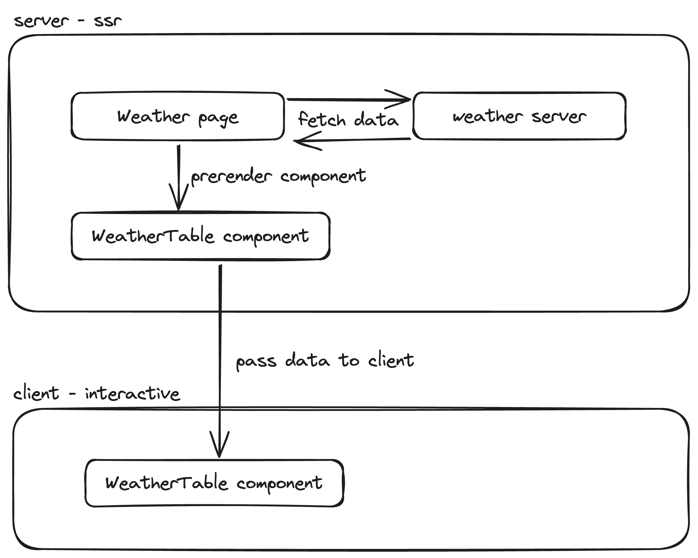

# Blazor Ssr Prerendered Interactive Page

[DEMO](https://blazorssrprerenderedinteractivepage.s1.elias.dev/)

This repo is an example of a SSR (Prerendered) 
Blazor page with an Interactive component, it solves the double 
initialization problem of the prerendered interactive components described in this youtube video: [This Blazor Issue Could Ruin Your Project 🔥 Learn How to Avoid It!](https://youtu.be/njA7Wb1F7pY?si=AZJwOA6f0KUPFERx)

Works with Blazor WebAssembly Interactive and Blazor Server Interactive.

## What's going on? 

The weather page is calling a weather service (dummy service in this case) that returns a random temperature every 
time it is called, the page is prerendered while the weather component is interactive yet still prerendered.

This gives you the possibility to prerender your page and still have interactive components 
depending on prerendered object fetching.

